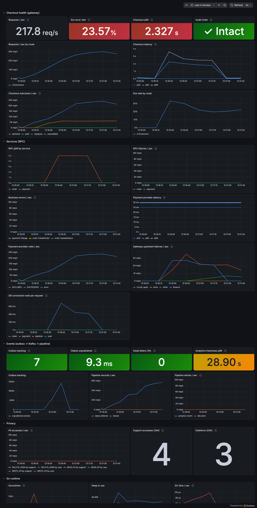

# Vault: a privacy-compliant commerce backend

Go microservices for an order → payment flow. User PII is encrypted per user, every PII access is written to a
tamper-evident audit log, and deleting a user makes that user's data unreadable everywhere (crypto-shredding).

**Stack:** Go · CloudWeGo Hertz (HTTP) and Kitex (RPC) · Postgres · Kafka (Redpanda) · OpenTelemetry + Jaeger ·
Prometheus + Grafana · k6 · Docker Compose · GitHub Actions


*The dashboard mid-way through `make chaos` at 300 checkouts/s: latency and database connection waits spike while
Postgres is frozen, the circuit breaker fails calls fast, the outbox holds ~14k events while Kafka is down and then
drains to zero, and the audit chain stays intact. Afterwards: 0 double charges, 0 lost events.*

```
Client → gateway (Hertz: JWT + roles, rate limit, request IDs)
            │ RPC
   ┌────────┼─────────────┐
 order     payment        user
 (outbox)  (idempotency)  (envelope-encrypted PII, crypto-shredding, audit log)
   │
   ▼ Kafka (Redpanda), keyed by user_id
 pipeline → redact/tokenize PII → analytics_events   (DLQ on poison messages)

Observability: OpenTelemetry traces → Jaeger · Prometheus metrics + alerts → Grafana
```

## Run it

```bash
make up && make topics      # Postgres, Redpanda, Jaeger, Prometheus, Grafana
make run                    # order + payment + user + gateway + pipeline (Ctrl-C stops all)

TOKEN=$(go run ./cmd/tokengen)
curl -i -X POST localhost:8080/v1/checkout \
  -H "Authorization: Bearer $TOKEN" -H "Idempotency-Key: my-first-order" \
  -H 'Content-Type: application/json' -d '{"amount_cents": 1999}'

make test                   # unit + integration tests (needs `make up`)
make e2e                    # 32-check end-to-end smoke test against the running services
make load                   # k6 load test at a fixed rate (needs `make run`)
make bench                  # latency, commits and WAL per checkout at 100-800 req/s
make chaos                  # break Postgres, Kafka and payment under load, then check consistency
```

### API

| Method | Path | Notes |
|---|---|---|
| POST | `/v1/checkout` | Needs `Authorization: Bearer` and `Idempotency-Key`. 201 PAID, 402 declined, 200 + `Idempotent-Replayed: true` on retry, 422 key reused with a different amount, 429 rate limited, 503 retry with the same key |
| GET | `/v1/orders/:id` | 404 for orders that aren't yours |
| PUT | `/v1/me/profile` | `{"email", "address"}`, stored encrypted. 409 if the email belongs to another account |
| GET | `/v1/me/profile` | Decrypts and audits the read |
| DELETE | `/v1/me` | Crypto-shreds the account: 204, then every copy of the PII is unreadable |
| GET | `/v1/support/users/:id/profile?reason=…` | Needs a `support` role token (`tokengen -role support`) and a reason; audited with both |

Internal only (admin ports): `/healthz`, `/readyz` and `/metrics` on every service (gateway 8090, order 8081,
payment 8082, user 8083, pipeline 8084), plus `GET localhost:8083/audit/verify`, which walks the audit hash chain.

## Observability

| Tool | URL | What it shows |
|---|---|---|
| Grafana | http://localhost:3000 | The **Vault** dashboard (home page): checkout health, RPC latency and failures, payment provider, outbox and pipeline, PII access, Go runtime |
| Jaeger | http://localhost:16686 | One trace per request, across gateway → order → payment → Kafka → pipeline, including every SQL query |
| Prometheus | http://localhost:9090/alerts | Alert rules: service down, 5xx rate, checkout p99, outbox stuck, dead letters, audit chain broken, payment provider errors |

- **Traces cross Kafka.** The relay publishes events later, from a background loop, so the outbox row stores the trace context of the request that wrote it and the relay sends it as Kafka headers. The pipeline's span joins the original checkout's trace.
- **Logs link to traces.** Log lines written with a request context carry `trace_id` and `span_id`.
- **Profiling:** every admin port serves `/debug/pprof`, e.g. `go tool pprof -top 'http://localhost:8081/debug/pprof/profile?seconds=15'`.
- **RED metrics everywhere:** rate, errors and duration for every HTTP route and RPC method, plus business metrics (checkout outcomes, payment provider latency, outbox backlog and age, analytics freshness, PII accesses by action and actor type).

## Performance

Everything (five services, Postgres, Redpanda, Jaeger, Prometheus, Grafana and the k6 load generator) runs on one
laptop: Apple M5, 10 cores, 16 GB. Absolute numbers are laptop numbers; the comparisons are what matter.

**Method.** k6 sends checkouts at a *fixed arrival rate* (`loadtest/checkout.js`). A closed loop of virtual users
sends less traffic exactly when the server slows down, which hides latency (coordinated omission). Traces are
sampled at 10%, as they would be in production. `loadtest/bench.sh` also records, per checkout, the Postgres
commits and WAL bytes written by the whole system, pipeline included, and analytics freshness (time from an order
event to its analytics row).

**Finding the bottleneck.** Checkout p99 went past the 200 ms target at around 1,000 req/s. The Go services were
not CPU-bound (the order service used 0.8 of a core, almost all of it in syscalls and scheduling). Sampling what
Postgres backends were waiting on gave 90% `LWLock:WALWrite` / `IO:WALSync`: commits queueing to flush the
write-ahead log. The limit was **commits per second**, not query speed. A third of all commits came from the
analytics pipeline, which inserted one event per commit; the same design made analytics fall minutes behind.

**Changes.**
1. **Batch the pipeline:** each poll from Kafka (up to 500 events) is written as one `INSERT ... SELECT FROM unnest(...)`: one statement, one commit.
2. **Delete outbox rows after publishing** instead of `UPDATE ... SET published_at` plus an hourly cleanup. An UPDATE writes a new copy of the row, JSON payload included, and the cleanup deleted old rows in bulk.

**Results:** median of 3 alternating runs per version (baseline = previous commit), 30 s per rate, 10% trace sampling.

| Rate | Version | Achieved req/s | Checkout p99 | Errors | Commits / checkout | Analytics freshness p99 |
|---|---|---|---|---|---|---|
| 800 | baseline | 784 | 929 ms | 0% | 4.78 | 29.7 s |
| 800 | optimized | 790 | 613 ms | 0% | **3.97** | **0.25 s** |
| 1,000 | baseline | 939 | 1,237 ms | 0% | 4.58 | 288 s |
| 1,000 | optimized | 966 | 767 ms | 0% | **3.95** | **0.25 s** |
| 1,200 | baseline | 805 | 3,967 ms | 10.4% | 4.47 | 296 s |
| 1,200 | optimized | 849 | 5,691 ms | 6.6% | **3.88** | **0.37 s** |

- **Analytics freshness improved by two to three orders of magnitude**, at every rate, in every run.
- **About 17% fewer commits per checkout**, consistent across every run.
- **Checkout latency: not a claim.** Repeated runs of the same build varied up to 6x at the same rate (p99 138-859 ms
  at 800 req/s), and both versions saturate by 1,200 req/s on this machine. The medians improved at 800 and
  1,000 req/s, but the noise is larger than the effect.

## Resilience

- **Timeouts** on every RPC (2 s, 0.5 s to connect).
- **Explicit retries on timeout** (`platform.Retry`), at most 2, with jittered backoff and no new retry after
  2.5 s; safe only because every RPC is idempotent. A **retry budget** (as in gRPC retry throttling) caps retries
  at about 10% of traffic, so an outage can't turn into a retry storm.
- **Circuit breaker per method** (for example `gateway/payment/Charge`): trips at 50% failures over at least 100
  calls in 10 s, then probes every 2 s. State changes are logged, and fast failures are counted in
  `gateway_upstream_failures_total{reason="circuit_open"}`.
- **Bounded graceful shutdown** everywhere: drain in-flight work, but exit after a deadline.

**Chaos test** (`make chaos`): 300 checkouts/s for 100 s while Postgres is frozen for 10 s, Kafka is stopped for
15 s and the payment service is killed for 10 s. Then it checks the data:

| Check | Result |
|---|---|
| Orders charged more than once | 0 |
| PAID orders without a successful payment | 0 |
| Events stuck in the outbox | 0 |
| Events missing from analytics | 0 |
| Checkout during the Kafka outage | unaffected (events waited in the outbox) |
| Recovery after the Postgres freeze and after payment restarts | next 10 s window |
| Checkout p99 over the whole run | 2.0 s (was 4.0 s with Kitex's built-in retry) |

The retry budget is why p99 halved: during the database freeze it allowed 185 retries and denied 1,358, so most
requests failed after one timeout instead of waiting out two. An earlier run with the circuit breaker switched
off had about 8% more failed checkouts and the same tail latency: the worst waits happen before enough calls have
failed to trip the breaker, which pays off most against a dependency that is slow rather than down.

**CI** starts Postgres, Redpanda and Jaeger, runs every test with `VAULT_INTEGRATION=1` (a missing database fails
the build instead of skipping tests), then starts all five services and runs the end-to-end smoke test.

**Bugs these tests found** (all fixed):
- **Stopped pipelines never exited.** With `BlockRebalanceOnPoll`, a poll interrupted by shutdown never called
  `AllowRebalance`, so closing the Kafka client blocked forever. Stale pipelines kept piling up in the consumer group.
- **Clock skew broke the payment lease.** After the Docker VM restarted, Postgres's clock ran 24 s behind the
  services. The lease check compared the database's `created_at` with the service's clock, so every PENDING charge
  looked expired and 20 concurrent retries all called the payment provider. The check now runs entirely in Postgres.
- **Jaeger ran out of memory** at ~1,000 req/s with 100% sampling (about 40k spans/s); it now keeps the newest 20k traces.
- **A service that couldn't bind its admin port kept running** with no health checks or metrics. It now fails to start.
- **Kitex's built-in retry lost business errors.** With it enabled, a declared Thrift exception (key reused,
  not found) reached the gateway as a nil response with a nil error, and the gateway crashed on it: a 422 became a
  500. Found by the end-to-end test; unit tests use fake clients and couldn't see it. Kitex v0.16.3 copies only the
  success field of the final attempt's result. Retries are now explicit in the gateway, with a regression test that
  runs a real Kitex client and server.
- **The circuit breaker kept checkout failing ~9 s after payment recovered** (Kitex's built-in suite waits 5 s
  before probing). Rebuilt from the same parts with a 2 s cooling period.

## Design decisions
- **Idempotent checkout, end to end:** orders are unique on `(user_id, idempotency_key)`, a payment's key is its order ID (one charge per order), and status updates are no-ops when already applied. A client can retry any failure with the same key.
- **"Reserve, then call out" for payments:** a PENDING row is inserted first (only one caller can win), then the PSP is called outside any transaction. A crash leaves the row PENDING; after a lease expires, the next retry re-asks the idempotent PSP.
- **404 instead of 403 for other users' orders:** callers can't probe which order IDs exist.
- **Per-user token-bucket rate limit, in memory:** simple and fast, but with N gateway replicas each user gets N x the limit. A shared limit would need Redis.
- **Commit rate is the scarce resource:** Postgres waits for the write-ahead log to reach disk on every commit, so the pipeline writes a whole batch per commit and the relay deletes published rows rather than updating them (see Performance).
- **Outbox instead of writing to the DB and Kafka separately:** writing to both can fail halfway and leave them inconsistent. If Kafka is down, checkout still works; events wait in the outbox and are published when it recovers (tested: stop Redpanda, check out, start it, and the events arrive).
- **One relay publishes at a time (Postgres advisory lock):** with parallel relays, a user's `order.paid` could reach Kafka before their `order.created`. A single publisher keeps per-user order; standby instances take over automatically if it dies, because the lock is released with its transaction.
- **Permanent vs transient failures in the consumer:** a malformed message goes to the DLQ with its reason and source offset, so it can't block the partition. A DB outage is retried with exponential backoff and jitter instead, because dead-lettering during an outage would dump every message. Offsets are committed only after the batch is stored.
- **Allowlist, not blocklist, for analytics:** the pipeline copies only named fields. A new PII field added to the event later is dropped by default.
- **HMAC tokens, not plain hashes:** anyone can hash a list of known user IDs and match a plain SHA-256. Without the key, they can't.
- **At-least-once delivery + idempotent consumers (PK on event_id):** this gives the effect of exactly-once processing.
- **Partition key = user_id:** events for one user stay in order.
- **Envelope encryption, one data key per user:** a master key (KMS in production) wraps each user's data key; the data key encrypts their email and address with AES-256-GCM. PII is encrypted before it leaves the user service, so the database, the outbox, Kafka and every backup only hold ciphertext.
- **Crypto-shredding for deletion:** `DELETE /v1/me` destroys the user's data key. Copies of their ciphertext already in Kafka, consumer databases or backups become permanently unreadable, without having to find and scrub each one. Orders stay (financial records have retention requirements) but hold no PII.
- **Ciphertext bound to (user, field):** GCM's associated data includes the user ID and field name, so a ciphertext copied into another user's row or another column fails to decrypt instead of showing the wrong person's data.
- **Blind index for email:** an HMAC of the normalized email enforces one account per email without decrypting every row.
- **Hash-chained audit log, written in the same transaction as the PII access:** every read, write and delete records actor and reason. If the audit write fails, the access fails ("no audit, no access"). Editing, deleting or reordering any entry breaks the chain, and `/audit/verify` reports the first bad entry.
- **Support access is allowed, but never silent:** it needs a staff role and a reason, both of which are audited.
- **Business errors aren't failures:** RPC metrics split outcomes into `ok`, `business_error` (not found, key reused: expected answers) and `error` (the service failing). Alerts fire only on `error`, so a client sending bad requests doesn't page anyone.
- **Route patterns as metric labels, never raw paths:** `/v1/orders/:id`, not `/v1/orders/<uuid>`. One time series per order ID would grow without bound and take down Prometheus.
- **Retries are explicit, and budgeted:** the gateway decides what to retry (timeouts only), not the RPC framework. See Resilience.
- **Time comparisons use one clock:** the payment lease is checked with Postgres's `now()` against the `created_at` Postgres wrote, never against a service's clock.
- **Latency buckets densest around the SLO:** percentiles are interpolated within a histogram bucket, so p99 is only as precise as the bucket it falls in. Counters also start at zero for every known label, so the first event registers as an increase.

## Known limitations
- All services share one Postgres database for local dev; in production each service would own its own database.
- A payment stuck PENDING is only resolved when the client retries. A background reconciliation job would fix this without waiting for the client.
- The pipeline writes one batch at a time from a single consumer. One goroutine per partition, or more consumers in the group, would scale it further.
- The first requests into a full outage still wait up to ~4 s (a timeout plus one retry) before the retry budget empties. A shorter per-attempt timeout would cap it, at the cost of more false timeouts under load.
- Benchmarks run on one laptop, where background work (autovacuum, checkpoints, other containers) makes tail latency vary several-fold between identical runs.
- One active relay caps outbox throughput at a single publisher. Fine at this scale; beyond that, partition the outbox by user and run one relay per shard.
- `user_keys` lives in the same Postgres as everything else. A database backup therefore contains the keys, and restoring an old backup would bring back a deleted user's key. In production the keys go in a separate store (a KMS, or a key database with short backup retention), so data backups never include them.
- Every PII read unwraps the data key. With a real KMS that's a network call, so you'd cache unwrapped keys briefly in memory, trading a small exposure window for latency.
- The audit chain is serialized by one lock, so it's a single point of contention. Sharding chains (per region or per tenant) would scale it. Anyone with write access to the whole table could also rewrite the whole chain; anchoring the head hash in a separate system prevents that.
- One outbox row for a Kafka topic that doesn't exist blocks the relay, because Kafka rejects the whole batch (this happened during development before `user.events` existed). A fix: move rows that fail permanently to a dead-letter table, the same way the pipeline handles poison messages.
- On Go 1.27, `sonic` (fast JSON) falls back to `encoding/json` (see the startup warning). Pinning the toolchain to Go 1.26 would restore it.

- Every request is traced (100% sampling). At production volume you'd sample a small fraction and keep every trace with an error.
- The user service re-verifies the whole audit chain every minute, so the check gets slower as the log grows. Verifying incrementally from the last checkpoint would fix that.

## Roadmap
- A chaos scenario for a slow (not dead) dependency, where a circuit breaker matters most
- A reconciliation job that finishes checkouts abandoned after a successful charge
